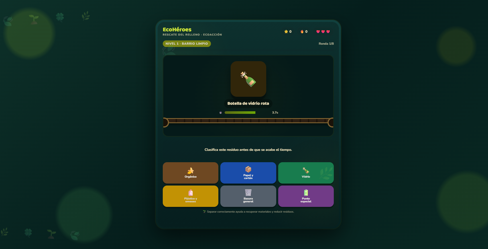

# ♻️ EcoHéroes: Rescate del Relleno

## 🎮 Descripción

**EcoHéroes: Rescate del Relleno** es un videojuego educativo de clasificación de residuos. El jugador debe identificar diferentes tipos de desechos y colocarlos en el contenedor correcto antes de que termine el tiempo.

El juego busca combinar aprendizaje y entretenimiento mediante retos de reciclaje, puntuación y retroalimentación educativa.

## 🎯 Objetivo

El objetivo del jugador es:

* ♻️ Clasificar correctamente los residuos.
* ⭐ Conseguir la mayor puntuación posible.
* 🔥 Mantener una buena racha.
* ❤️ Conservar las vidas disponibles.
* ⏱️ Responder antes de que termine el tiempo.
* 🏆 Completar las rondas del juego.

## 🕹️ Mecánica principal

En cada ronda aparece un residuo que el jugador debe identificar.

Después debe seleccionar el contenedor correspondiente antes de que termine el tiempo.

El juego proporciona retroalimentación después de cada respuesta para explicar la clasificación del residuo.

La partida incorpora:

* Puntos.
* Rachas.
* Vidas.
* Aciertos.
* Precisión.
* Rondas y niveles.

## ♻️ Tipos de clasificación

El juego presenta diferentes categorías de residuos, entre ellas:

* 📦 Papel y cartón.
* 🧴 Plástico y envases.
* 🍾 Vidrio.
* 🍌 Orgánico.
* 🗑️ Basura general.
* 🔋 Punto especial.

## ❤️ Sistema de vidas

El jugador comienza con:

**❤️❤️❤️ 3 vidas**

Las vidas permiten controlar los errores cometidos durante la partida.

## ⭐ Sistema de puntuación

Durante el juego se registran:

* ⭐ Puntos.
* 🔥 Racha.
* ❤️ Vidas.
* 🎯 Aciertos.
* 📊 Precisión.

Al finalizar la misión se muestra el resultado obtenido.

## ⏱️ Tiempo

Cada residuo debe clasificarse dentro de un tiempo limitado. La cuenta regresiva aumenta la dificultad y obliga al jugador a tomar decisiones rápidamente.

## 📊 Progreso

El juego está organizado mediante niveles y rondas. La interfaz muestra el progreso de la partida y permite al jugador conocer cuánto falta para completar la misión.

## 🎨 Género

**Educativo / Casual**

## 🎮 Controles

| Acción                        | Control          |
| ----------------------------- | ---------------- |
| Seleccionar contenedor        | **Mouse / clic** |
| Interactuar con los elementos | **Mouse / clic** |

## 📸 Captura de pantalla

## 🌐 Jugar

[🎮 JUGAR ECOHÉROES](https://pattybln.github.io/game-development-portfolio/ECOHEROES/)

## 💻 Tecnologías utilizadas

* HTML5
* CSS3
* JavaScript
* Visual Studio Code
* GitHub
* GitHub Pages

## 🤖 Uso de Inteligencia Artificial

La Inteligencia Artificial fue utilizada como herramienta de apoyo durante el desarrollo para generar ideas, mejorar el código, corregir errores y proponer mejoras en la interfaz y las mecánicas.

El proyecto fue probado y adaptado durante el proceso de desarrollo.

## 📚 ¿Qué aprendí?

Durante el desarrollo de **EcoHéroes** aprendí a:

* Crear un videojuego educativo.
* Implementar sistemas de clasificación.
* Programar temporizadores.
* Crear sistemas de puntos y rachas.
* Implementar vidas y estadísticas.
* Diseñar retroalimentación educativa.
* Organizar rondas de juego.
* Publicar un proyecto mediante GitHub Pages.
* Documentar un videojuego.

## 🚀 Próximas mejoras

* ♻️ Agregar más tipos de residuos.
* 🎯 Incorporar nuevos niveles y rondas.
* 🗺️ Crear nuevos escenarios.
* 🔊 Agregar efectos de sonido y música.
* ✨ Mejorar las animaciones.
* 🏆 Añadir logros y récords.
* 📊 Ampliar las estadísticas.
* 🧠 Incorporar más contenido educativo sobre reciclaje.
