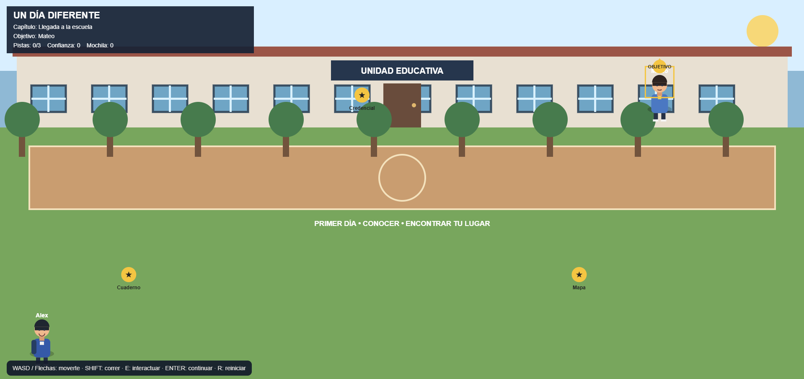

# 🏫 Un Día Diferente

## 🎮 Descripción

**Un Día Diferente** es un videojuego narrativo de exploración ambientado en una escuela.

El jugador controla a **Alex**, un estudiante nuevo que llega a una escuela y comienza a explorar su entorno. Durante la historia, Alex conoce a otros personajes, encuentra objetos y pistas y se enfrenta a una situación relacionada con un rumor y un mensaje ofensivo sobre una compañera.

La historia avanza mediante exploración, interacción y diálogos.

## 🎯 Objetivo

Completar los diferentes capítulos de la historia ayudando a Alex a:

* Explorar la escuela.
* Encontrar objetos y pistas.
* Interactuar con otros personajes.
* Ayudar a Sofía.
* Entregar las pistas a la orientadora.
* Completar las acciones de ayuda.
* Llegar al final de la historia.

## 🕹️ Mecánicas principales

El juego combina **exploración, interacción, recolección de objetos y narrativa**.

La historia está dividida en cuatro capítulos:

### 1. Llegada a la escuela

Alex debe explorar el patio, recoger tres objetos y hablar con Mateo.

### 2. El rumor

Alex debe encontrar tres pistas relacionadas con el rumor y después hablar con Sofía.

### 3. Hacer algo

Alex debe entregar las pistas a la orientadora y acompañar a Sofía a un lugar tranquilo antes de hablar con Leo.

### 4. Un día diferente

Alex regresa al aula y completa la historia hablando con Sofía.

## 👥 Personajes

* **Alex:** protagonista controlado por el jugador.
* **Mateo:** estudiante que ayuda a Alex a conocer la escuela.
* **Sofía:** estudiante afectada por el rumor.
* **Leo:** estudiante involucrado en la difusión del mensaje.
* **Orientadora:** personaje que recibe las pistas y brinda apoyo.

## 🎮 Controles

| Tecla       | Acción            |
| ----------- | ----------------- |
| **W / ↑**   | Mover arriba      |
| **S / ↓**   | Mover abajo       |
| **A / ←**   | Mover izquierda   |
| **D / →**   | Mover derecha     |
| **SHIFT**   | Correr            |
| **E**       | Interactuar       |
| **ENTER**   | Continuar diálogo |
| **ESPACIO** | Continuar diálogo |
| **R**       | Reiniciar         |

## 📊 Sistema de progreso

Durante la aventura se registran:

* **Pistas encontradas:** 0/3.
* **Confianza:** aumenta al realizar acciones de ayuda.
* **Mochila:** registra los objetos y pistas.
* **Capítulos:** 4.

## 🗺️ Escenarios

El juego cuenta con diferentes ambientes escolares:

* 🌳 Patio.
* 🏫 Pasillo.
* 📚 Biblioteca y espacio de apoyo.
* 🧑‍🏫 Aula.

## 🎵 Audio

El videojuego incorpora música de misterio generada mediante **Web Audio API**.

## 🎨 Género

**Adventure / Narrative / Exploration**

## 💻 Tecnologías

* HTML5
* CSS3
* JavaScript
* Canvas API
* Web Audio API
* Visual Studio Code
* GitHub Pages

## 📸 Captura de pantalla

## 🌐 Jugar

[🎮 JUGAR UN DÍA DIFERENTE](https://pattybln.github.io/game-development-portfolio/UN_DIA_DIFERENTE/)

## 🤖 Uso de Inteligencia Artificial

La Inteligencia Artificial fue utilizada como herramienta de apoyo para generar ideas, mejorar el código, revisar estructuras y proponer mejoras durante el desarrollo del videojuego.

El proyecto fue probado y adaptado para cumplir con los objetivos planteados.

## 📚 ¿Qué aprendí?

Durante el desarrollo aprendí a:

* Crear un videojuego narrativo.
* Utilizar Canvas para dibujar escenarios y personajes.
* Programar movimiento.
* Implementar interacción mediante teclado.
* Crear diálogos y progresión narrativa.
* Diseñar capítulos dentro de un mismo videojuego.
* Implementar sistemas de pistas, inventario y confianza.
* Utilizar Web Audio API.
* Publicar un videojuego con GitHub Pages.

## 🚀 Próximas mejoras

* Agregar más escenarios.
* Incorporar nuevos personajes.
* Ampliar los diálogos y decisiones.
* Añadir nuevas pistas y misiones.
* Crear diferentes finales.
* Mejorar el sistema de audio.
* Agregar más animaciones.
* Incorporar nuevas interacciones.

